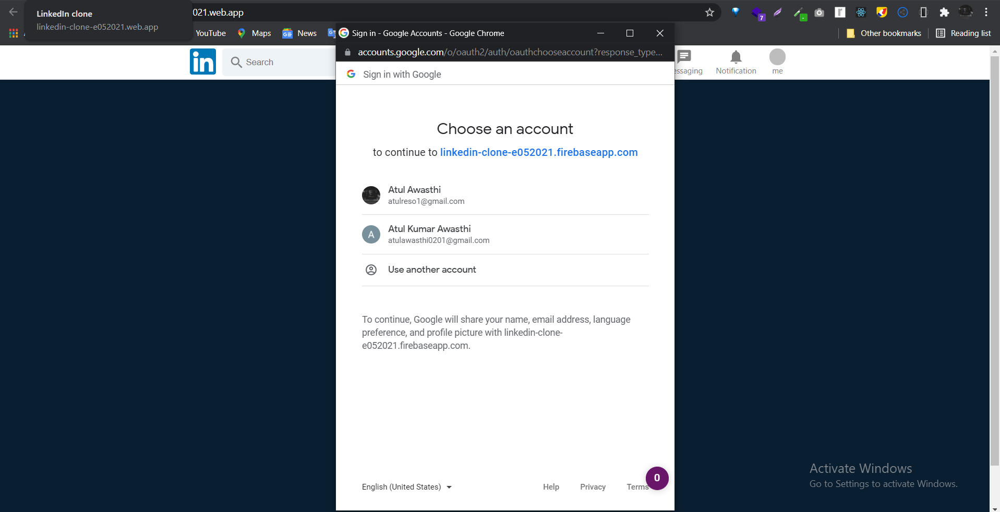
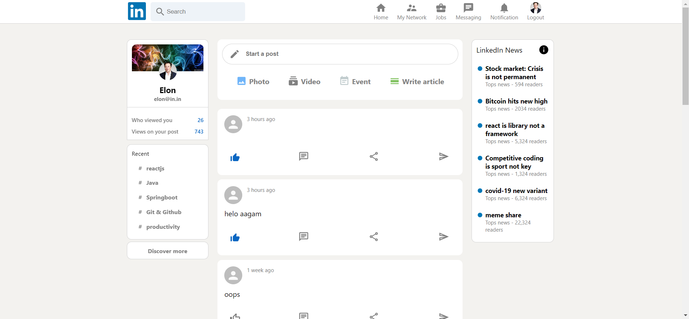
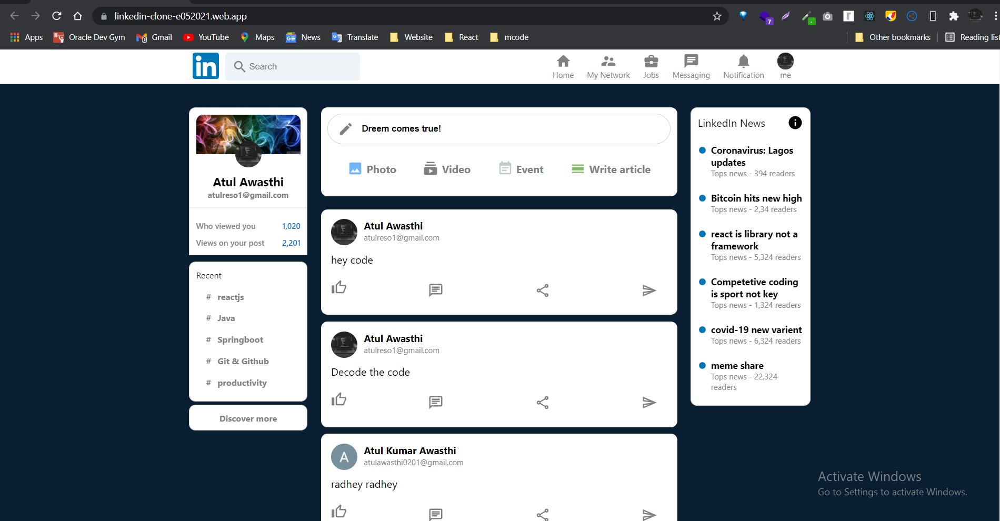
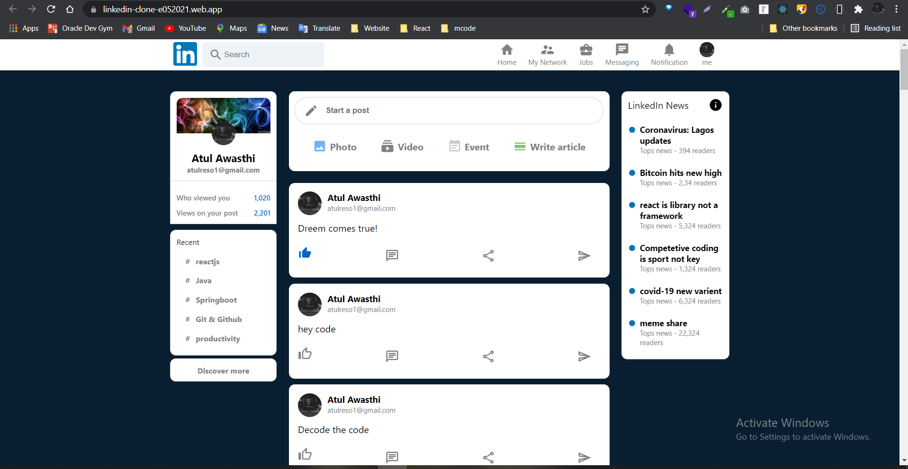

## LinkedIn clone Using-React-Redux 

## Table of Contents

- [About the Project](#about-the-project)
- [Functionalities](#Features)
- [Snapshot](#snapshot)
- [Technologies Used](#technologies-used)
- [Installation](#installation)
- [Acknowledgements](#test)
- [License](#license)

### About the Project

The LinkedIn-clone web application presents a custom LinkedIn-clone.The APP is created with the latest industry standards using React.js and Redux Toolkit
Firebase is used for the backend  

## :sparkles: Features

:heavy_check_mark: Users can register using Full name, image url, email, and password or signIn with Google.

:heavy_check_mark: Logged in users can can view other peoples posts and can add their own post in the feed.

:heavy_check_mark: Post Like , comment functionality.

:heavy_check_mark: Users can click on avatar on the navbar to sign out.

### Snapshots of project 👇

## ▶️ Demo

[Project live link](https://linkedin-clone-e052021.web.app/)

### Technologies Used

1. [React](https://reactjs.org/)
2. [Redux](https://redux.js.org/)
3. [Material UI](https://material-ui.com/)
4. [Firebase's Firestore](https://firebase.google.com/)
5. [Firebase's Authentication](https://firebase.google.com/docs/auth)
6. [Git](https://git-scm.com/)

### Installation

**To get this project set up on your local machine, follow these simple steps:**

**Step 1** 
Navigate through the local folder where you want to clone the repository and run 
`https://github.com/kumaratul60/LinkedIn-clone.git`. It will clone the repo to your local folder. 
**Step 2** 
Run `cd LinkedIn-clone-Using-React-Redux` 
**Step 3** 
Run `npm install` to install the npm packages from the `package.json` file. 
**Step 4** 
Run `npm start` to start the webpack server, you can now navigate to `http://localhost:3000` to view the app. The server refreshes the app every time you make a change to a file used by it. 

## Tests

1. Open Terminal

2. Install dependencies :

   `npm install`

3. Run the tests with the command:

   `npm test`

## License

📝
This project is [MIT](https://opensource.org/licenses/MIT) licensed.
